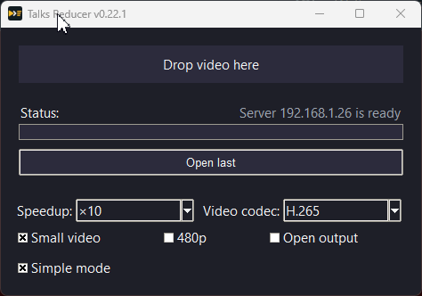
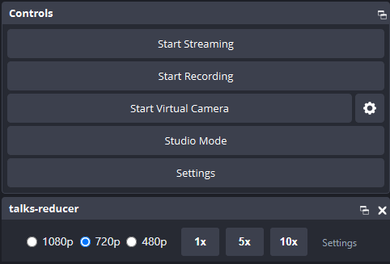

# Talks Reducer [](https://coveralls.io/github/popstas/talks-reducer?branch=master)

Talks Reducer shortens long-form videos by removing silent gaps and optionally
re-encoding them to much smaller files.



## Example

- 1h 37m, 571 MB — Original OBS video recording
- 1h 19m, 751 MB — Talks Reducer
- 1h 19m, 171 MB — Talks Reducer `--small`

## Features

- **Speeds up the silence** — no montage editing.
- **Shrinks the file** — typically 8–10× smaller, web-friendly.
- **Fast** — in-memory audio/video processing, auto GPU encoding.
- **Extract audio** — export an audio-only `.mp3` instead of video.
- **Simple mode** — one drop zone, minimum settings.
- **Named presets** — save a settings bundle once, apply it on every surface.
- **Remote mode** — offload to your fastest machine.
- **Watch mode** — convert the latest video from a recordings folder.
- **OBS integration** — convert buttons inside an OBS dock.
- **LNK presets** — drag a video onto a preset shortcut to convert.
- **Mobile app / WebUI** — use a remote server from your phone.
- **CLI mode** — batch files and directories from the terminal.

## Install

### Windows

Download the installer from the [releases page](https://github.com/popstas/talks-reducer/releases)

### macOS

```sh
brew tap popstas/talks-reducer
brew trust --cask popstas/talks-reducer/talks-reducer
brew install --cask talks-reducer
```

> Homebrew 6.0.0+ requires `brew trust --cask` to approve a cask from a third-party tap
> before it can be installed. Without it, the install fails with a "Refusing to load cask
> from untrusted tap" error.

### pip / pipx / uv (Linux, Windows, macOS)

```sh
pip install talks-reducer      # install the CLI and GUI
pipx install talks-reducer     # or into an isolated environment
uv tool install talks-reducer  # or with uv
```

## OBS Processing Dock (Windows)

For OBS Studio recordings, a Custom Browser Dock starts Talks Reducer right after you stop
a take — pick resolution, silent speed, and codec, then click a button.



**Set it up in OBS:**

1. Start the dock server and keep it running while you record — or let the Windows
   installer add it to autostart:

   ```powershell
   talks-reducer dock-server
   ```

2. In OBS, enable **Tools → WebSocket Server Settings → Enable WebSocket server** and note
   the password.
3. In OBS, open **Docks → Custom Browser Docks…** and add a dock with URL
   `http://127.0.0.1:17890/`.
4. In the dock's **Settings**, enter the OBS WebSocket password and press **Enter**. When
   the status turns green, stop a recording and the speed buttons light up.

Full setup, options, and troubleshooting: [docs/obs-dock.md](docs/obs-dock.md).

## Command line

```sh
talks-reducer input.mp4                                    # tuned encode at the source resolution
talks-reducer --small input.mp4                            # same, scaled down to 720p
talks-reducer --480 input.mp4                              # scale down to 480p instead
talks-reducer --video-codec mp3 talk.mp4                   # export audio only, as .mp3
talks-reducer --cut-start 00:00:10 --cut-end 00:01:00 demo.mp4  # keep only 10s–60s
talks-reducer --url http://localhost:9005 demo.mp4         # process on a remote server
talks-reducer --preset "480p 10x speedup H.265" demo.mp4   # apply a saved preset
talks-reducer --list-presets                               # print the saved preset names
```

Every input can also be a directory, and you can pass as many as you like in one run.

**Presets** are saved bundles of processing settings (resolution, speeds, threshold, codec)
you author once in the desktop GUI's Advanced mode and reuse everywhere — Simple mode, the
Web UI, the OBS dock, and the CLI (`--preset`). When saving you pick which settings the preset
controls, so a preset can be partial (e.g. codec-only) and applying it leaves your other
settings alone. They live in the shared `settings.json`, so one list appears on every surface,
and each surface opens on the preset you used last. See
[docs/cli.md](docs/cli.md#named-presets).

→ Full flag reference — codecs, keyframes, silence thresholds, trimming, remote options:
[docs/cli.md](docs/cli.md).

## Remote server

Run Talks Reducer on the machine with the fast GPU and send jobs to it from anywhere on
your network — laptops, phones, or other desktops.

```sh
talks-reducer server        # browser interface in the terminal
talks-reducer server-tray   # same server, tucked into the system tray
```

Open the printed `http://localhost:9005` address, drop a video on the page, and download
the result when it finishes. Use `--host` and `--port` to bind somewhere else:

```sh
talks-reducer server --host 0.0.0.0 --port 7860
```

Prefer not to touch the terminal? The desktop GUI's **Advanced** panel has a **Run as
server in tray** checkbox that starts the same tray-managed server (and keeps the setting
for next launch).

To send work from another machine, point the CLI or the desktop GUI at the server with
`--url http://<server>:9005` (or `--host <server>`).

→ Server and tray options, the operator view, and scripted uploads:
[docs/server.md](docs/server.md).

## Install as an app (PWA)

The web interface is an installable Progressive Web App. Open it in a Chromium-based
browser and choose **Install app** to get a standalone Talks Reducer window with its own
icon.

Browsers only offer installation over `https://` or `http://localhost`, so put a TLS proxy
in front of a LAN server if the install prompt does not appear.

This also works from a phone: install the page served by a Talks Reducer server on your
network, then upload recordings to it like any other app.

## Changelog

See [CHANGELOG.md](CHANGELOG.md).

## Contributing

See [CONTRIBUTION.md](CONTRIBUTION.md) for development setup details and guidance on sharing improvements.

## License

It grew out of [gegell/jumpcutter](https://github.com/gegell/jumpcutter)
and was renamed from **jumpcutter** to emphasize its focus on conference talks and screencasts.

Talks Reducer is released under the MIT License. See `LICENSE` for the full text.
